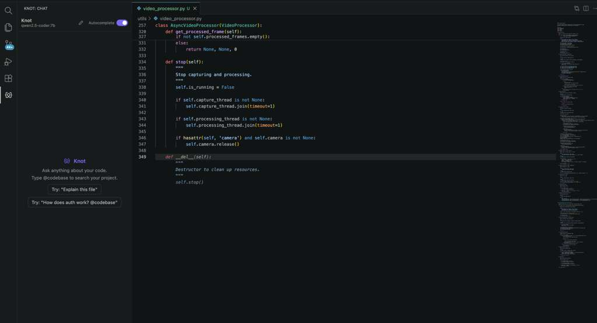
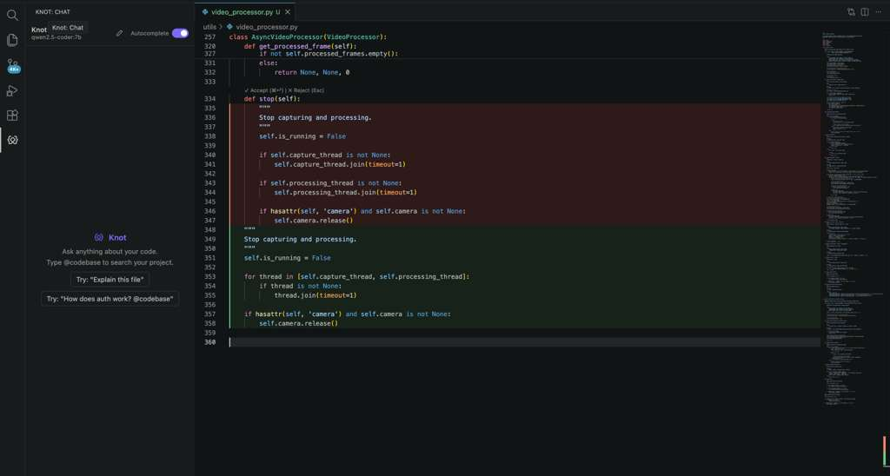
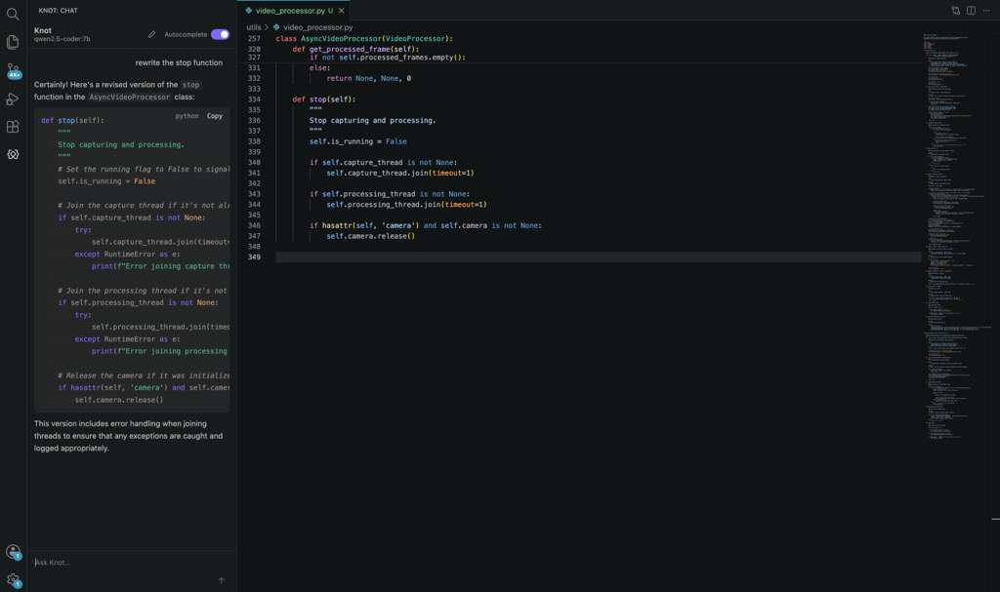
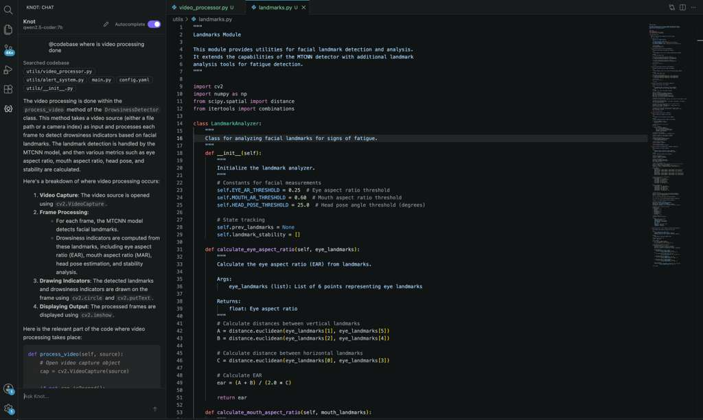

<p align="center">
  
</p>

<p align="center">
  <a href="https://marketplace.visualstudio.com/items?itemName=freshgoldfish.knot-ai"></a>
  <a href="https://marketplace.visualstudio.com/items?itemName=freshgoldfish.knot-ai"></a>
  
</p>

<p align="center">
  <strong>Built by Keisha Kaba &amp; Shobhit Sinha</strong>
</p>

Zero-config, fully local AI coding assistant for VS Code: **Tab autocomplete**,
**Cmd+K inline editing**, **sidebar chat**, and **`@codebase` search**, all powered by
[Ollama](https://ollama.com) running on your own machine. Nothing you write ever
leaves your computer: every model call goes to `127.0.0.1`.

Knot brings Copilot-style assistance right into your editor without the cloud:
no account, no API key, and no telemetry. On first run it detects your hardware,
pulls right-sized models to match your RAM, and indexes your project so answers
stay grounded in your actual code. Open a folder and start typing; there's
nothing else to configure.

> **v1 scope:** macOS on Apple Silicon (M-series) only. Intel Macs, Windows, and
> Linux are out of scope for this release. See [`docs/`](./docs) for the full spec.

---

## What you get

| Feature                  | How to use it                                                                                                                                                              |
| ------------------------ | -------------------------------------------------------------------------------------------------------------------------------------------------------------------------- |
| **Tab autocomplete**     | Pause while typing in a supported language; ghost text appears. **Tab** to accept, **Esc** to dismiss.                                                                     |
| **Cmd+K inline editing** | Select code, press **Cmd+K**, type an instruction. The rewrite streams in as a red/green diff. **Cmd+Enter** to accept, **Esc** to reject (restores the original exactly). |
| **Sidebar chat**         | Click the Knot icon in the activity bar. Streaming answers, your current file as automatic context, markdown + syntax highlighting, **Stop** / **New Chat**.               |
| **`@codebase` search**   | Type `@codebase` in a chat message to ground the answer in your indexed project, with file/line citations.                                                                 |

A toggle in the chat header turns inline completions on/off live.

---

## See it in action

**Tab autocomplete:** pause while typing and accept the ghost text with **Tab**.



**Cmd+K inline editing:** select code, describe the change, and review the
red/green diff before accepting.



**Sidebar chat:** ask about your code; answers stream with syntax-highlighted,
one-click-copyable code blocks.



**`@codebase` search:** ground answers in your indexed project, with the searched
files cited.



---

## Requirements

- **macOS on Apple Silicon.**
- **VS Code 1.85+.**
- **~5–30 GB free disk**, depending on your hardware tier. Knot picks
  model sizes to match your RAM and downloads them on first run.
- **[Ollama](https://ollama.com)**: if it isn't installed, Knot installs it
  for you via the official script on first activation and starts it automatically.

You do **not** need to configure anything, sign in, or get an API key. There is no
cloud account and no telemetry.

---

## Install

Knot is on the
[VS Code Marketplace](https://marketplace.visualstudio.com/items?itemName=freshgoldfish.knot-ai).

- **In VS Code:** open the Extensions view, search **"Knot AI"**, and click
  **Install**.
- **In a terminal:** `code --install-extension freshgoldfish.knot-ai`

Then open a project folder. No build step, no sign-in, no API key.

<details>
<summary>Or install from a <code>.vsix</code> file</summary>

Grab `knot-ai-<version>.vsix` (from a release or built locally with
`npx @vscode/vsce package`), then:

- **In VS Code:** Extensions view → the **⋯** (More Actions) menu →
  **Install from VSIX…** → pick the file.
- **In a terminal:** `code --install-extension knot-ai-0.1.0.vsix`

</details>

### First run: guided setup

The first time you open a folder, Knot's **onboarding opens in the sidebar**
and sets everything up for you:

1. **Welcome** → click **Get Started**.
2. **Hardware detection:** picks chat / autocomplete / embedding models to match
   your chip and RAM.
3. **Download models:** review the models + sizes, click **Download Models**.
   The first download takes a few minutes (progress bar + time estimate).
4. **Indexing:** your workspace is indexed so `@codebase` can search it.
5. **Ready** → click **Start Coding**.

It runs **once** per machine; after that, opening a folder is instant. If a
download is interrupted, setup resumes where it left off. Detailed logs are in
**View → Output → Knot**.

> Need to redo setup (e.g. you cleared your models)? Run **Knot: Reset and
> Re-run Setup** from the Command Palette. Knot also auto-reruns setup if a
> required model goes missing.

### Run from source (developers)

```bash
git clone https://github.com/shobhitsinha04/knot.git
cd knot
npm install
npm run build      # bundle to dist/extension.js
```

Open the folder in VS Code and press <kbd>F5</kbd> to launch an Extension
Development Host with Knot loaded.

---

## Using it

- **Autocomplete:** start typing and pause; accept with **Tab**. Rapid typing
  cancels stale suggestions. A status-bar spinner shows while one is generating.
- **Cmd+K editing:** select the code to change, press **Cmd+K**, and describe the
  edit ("add error handling", "convert to async", ...). Review the red/green diff,
  then **Cmd+Enter** to keep it or **Esc** to discard.
- **Chat:** open the sidebar and ask questions; your active file is sent as
  context automatically. Code blocks are syntax-highlighted with a copy button.
- **`@codebase`:** include `@codebase` in your question to search the whole
  indexed project, e.g. `@codebase where do we map RAM to a tier?`. Answers cite
  the files and line ranges they're drawn from.

### Commands (Cmd+Shift+P)

- **Knot: Rebuild Index** forces a clean, full re-index of the workspace
  (use if `@codebase` results look stale or incomplete).
- **Knot: Edit Selection**, **Accept Edit**, **Reject Edit**: the Cmd+K
  flow (also bound to Cmd+K / Cmd+Enter / Esc).

---

## Privacy

Everything runs locally through Ollama on `127.0.0.1:11434`. Your code, prompts,
and chat history never leave your machine, and there is no analytics or telemetry.
The only outbound network access is the one-time Ollama install script and model
downloads from the Ollama registry.

---

## Troubleshooting

- **Setup or model issues:** open the **Knot** Output channel for detailed
  logs (hardware detection, install, model pulls, request timing).
- **`@codebase` answers look stale or wrong:** run **Knot: Rebuild Index**.
- **First completion is slow:** the model is loading; it stays warm afterward.
- **Known issues, fixes, and their caveats** are catalogued phase by phase in
  [`docs/ISSUES_AND_FIXES.md`](./docs/ISSUES_AND_FIXES.md).

---

## Giving feedback

Bug reports, confusion, and "this felt slow/awkward" are all useful.

**Where:** open a
[GitHub issue](https://github.com/shobhitsinha04/knot/issues).

**What to include** (so we can act on it fast):

- What you did and what you expected vs. what happened.
- Your setup: macOS version, chip + RAM (e.g. M2 / 16 GB), Knot version.
- Which feature: autocomplete / Cmd+K / chat / `@codebase` / onboarding.
- Relevant lines from the **Knot** Output channel
  (**View → Output → Knot**). It never contains your code, only setup and
  timing logs.

Since everything runs locally, we can't see anything unless you tell us, so
concrete repro steps go a long way.

---

## Development

Requires Node.js 18+ and VS Code.

```bash
npm install        # install toolchain
npm run build      # bundle the extension with esbuild -> dist/extension.js
npm run watch      # rebuild on change
npm run lint       # ESLint
npm run format     # Prettier (write)
npm test           # Vitest unit tests
npm run typecheck  # tsc --noEmit (both the extension and webview configs)
```

Press <kbd>F5</kbd> to build and launch the Extension Development Host.

### Branching strategy

`main` (stable) <- `dev` (integration) <- feature branches. `dev` is merged into
`main` via GitHub Pull Requests. See `docs/PHASES.md`.

---

## Documentation

All product and architecture specs live in [`docs/`](./docs). Start with
[`docs/PROJECT.md`](./docs/PROJECT.md); see [`docs/CHANGELOG.md`](./docs/CHANGELOG.md)
for current state and [`docs/ISSUES_AND_FIXES.md`](./docs/ISSUES_AND_FIXES.md) for
the issue/fix history.
